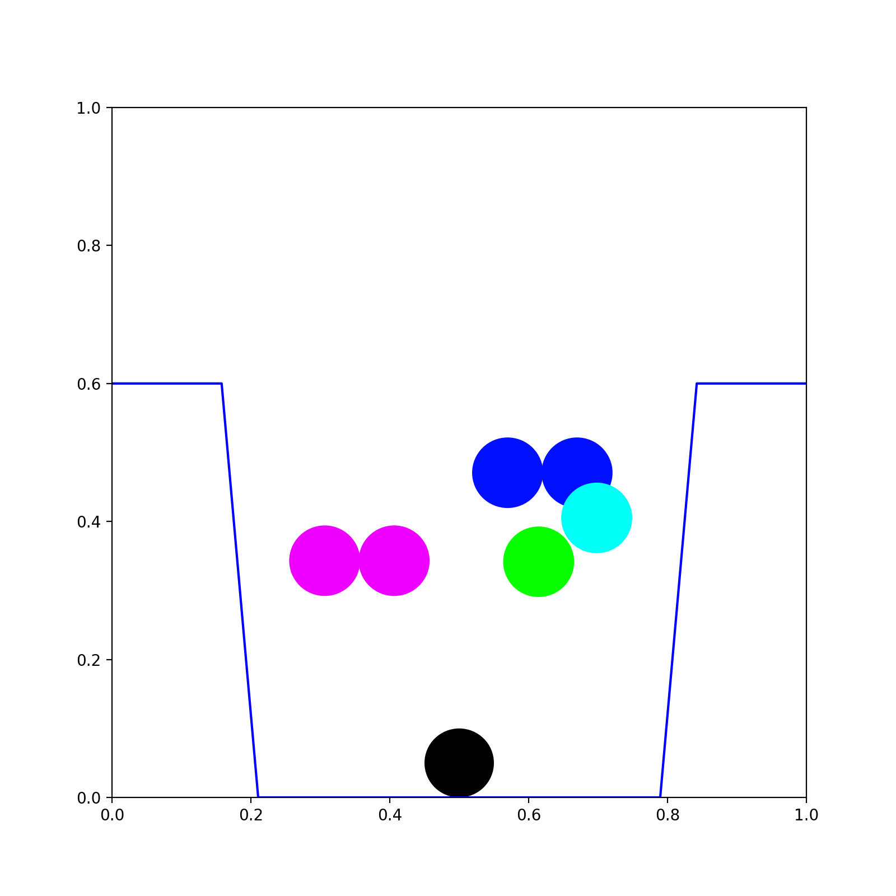

# Hoppe's urn model

分割の確率モデルであるホップの壺モデルを理解するために実装した．

ホップの壺モデルの主な特徴は3つ挙げられる．

1. 色玉がある組み合わせで壺に入れられる確率は，色玉の入れられた順序に依存しない．
1. 壺に入れられる色玉の種類は試行とともに増大する．
1. aの値が大きいほど，壺の中により多くの異なる種類の色玉が入れられ，逆にaの値が小さいほど，色玉の種類数が減少し，特定の(複数の)色玉の個数が増大しやすくなる

### calc_process.py

ホップの壺モデルの過程から，ホップの壺モデルがその順序に依存しないことを確認できる．

### compare_plobability.py

ホップの壺モデルの確率はその順序に依存しないことを比較，確認できる．

### plot_process.py

ホップの壺モデルの過程をリアルタイム描画し，最終的な結果を `final_urn.png` に保存する．

